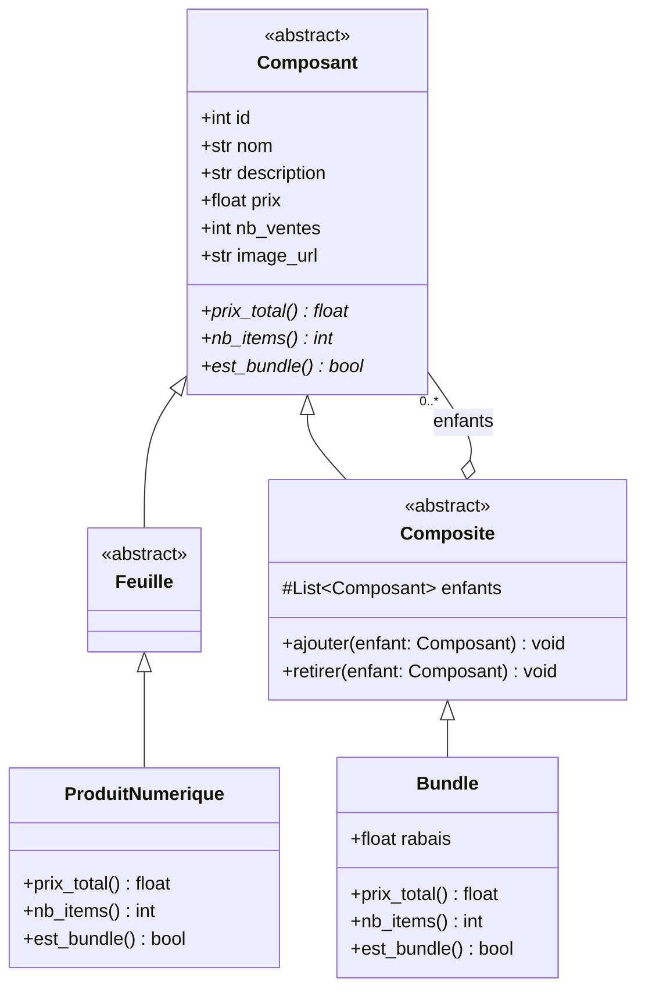

```mermaid
classDiagram
    direction TB

    class Composant {
        <<abstract>>
        +int id
        +str nom
        +str description
        +float prix
        +int nb_ventes
        +str image_url
        +prix_total()* float
        +nb_items()* int
        +est_bundle()* bool
    }

    class Feuille {
        <<abstract>>
    }

    class Composite {
        <<abstract>>
        #List~Composant~ enfants
        +ajouter(enfant: Composant) void
        +retirer(enfant: Composant) void
    }

    class ProduitNumerique {
        +prix_total() float
        +nb_items() int
        +est_bundle() bool
    }

    class Bundle {
        +float rabais
        +prix_total() float
        +nb_items() int
        +est_bundle() bool
    }

    Composant <|-- Feuille
    Composant <|-- Composite
    Feuille <|-- ProduitNumerique
    Composite <|-- Bundle
    Composite o-- "0..*" Composant : enfants
```