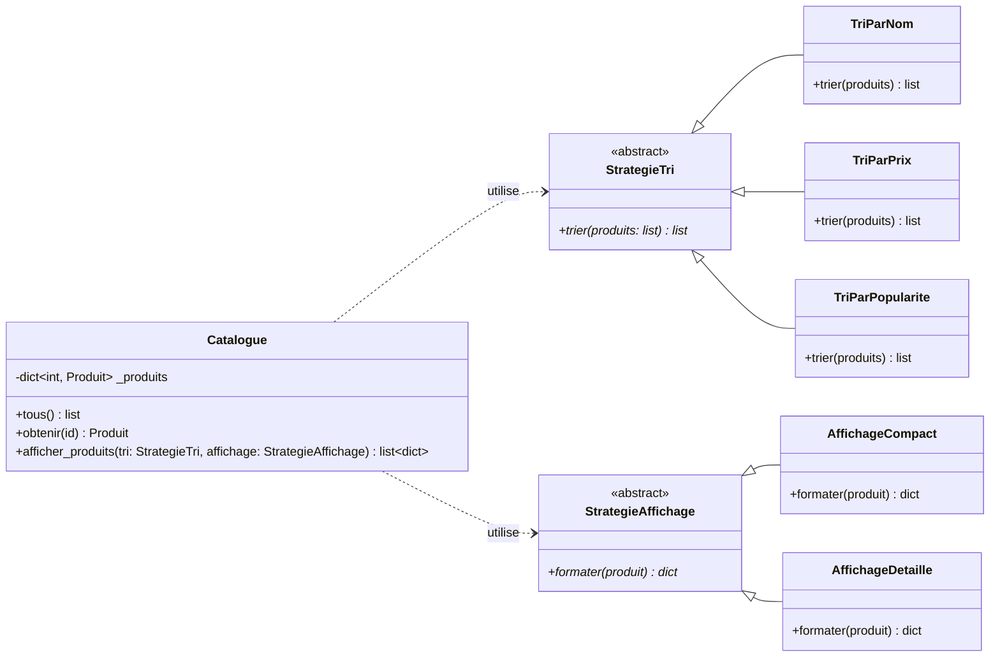

```mermaid
classDiagram
    direction LR

    class Catalogue {
        -dict~int, Produit~ _produits
        +tous() list
        +obtenir(id) Produit
        +afficher_produits(tri: StrategieTri, affichage: StrategieAffichage) list~dict~
    }

    class StrategieTri {
        <<abstract>>
        +trier(produits: list) list*
    }
    class TriParNom {
        +trier(produits) list
    }
    class TriParPrix {
        +trier(produits) list
    }
    class TriParPopularite {
        +trier(produits) list
    }

    class StrategieAffichage {
        <<abstract>>
        +formater(produit) dict*
    }
    class AffichageCompact {
        +formater(produit) dict
    }
    class AffichageDetaille {
        +formater(produit) dict
    }

    StrategieTri <|-- TriParNom
    StrategieTri <|-- TriParPrix
    StrategieTri <|-- TriParPopularite

    StrategieAffichage <|-- AffichageCompact
    StrategieAffichage <|-- AffichageDetaille

    Catalogue ..> StrategieTri : utilise
    Catalogue ..> StrategieAffichage : utilise
```